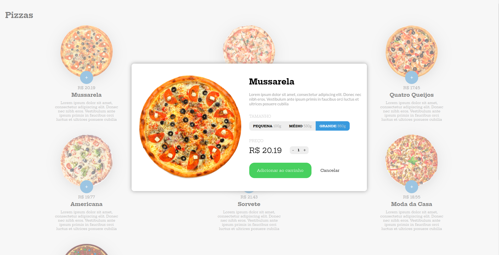

# e-pizza

This is a restaurant interface designed for a pizza delivery service, featuring a convenient side-cart implementation. The interface was created using HTML5, CSS3 and JavaScript ES6, ensuring that it is both visually appealing and highly functional.

One of the key features of this interface is the side-cart implementation, which allows customers to easily add items to their order and view their current selections. The interface also includes clear call-to-action buttons and a simple navigation system, making it easy for users to find what they're looking for.

Live here: https://lamongabriel.github.io/e-pizza/
